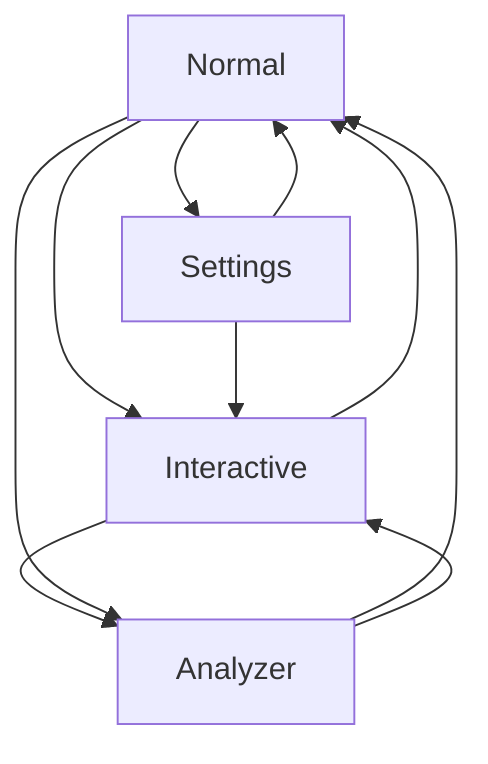

# Klemme

`klemme` (pronounce `clammy`, German for "Terminal") is a serial terminal application designed
for developers. klemme is a mode based application, i.e. at any given time it can be in any of the following modes:

* Normal, this mode allows to exit the app and to switch to the other modes.
* Settings, allows the use to setup the used port and port settings
* Interactive, opens the port outputs received data and allows the user to send data through the port
* Analyzer, allows the user to analyze received data (e.g. look at bit representations of indiviual bytes)

## Features

* Supports common baud rates & port settings
* Wide range of display modes that can be applied retro actively

## Modes

## Keys

### General

* esc - Change to normal mode
* F10 - Clear history

### Normal Mode

* a - enter analyzer mode
* s - enter settings mode
* i - enter interactive mode
* esc - exit

### Settings mode

* q - Exit application
* p - select port
* b - select baud rate
* s - select stop bits
* a - select parity
* d - select databits
* m - select display mode
* c - select CRLF settings

### Interactive

* Up - Scroll Receive Buffer Up
* Down - Scroll Receive Buffer Down
* Enter - Send current send buffer (according to CRLF and Input settings)
* F3 - Change input mode

### Analyzer

* F2 - Change display mode
* Up/Down - Scroll Receive buffer
* Left/Right - Move analyzer cursor

## Display modes

klemme supports displaying data in several different modes:

* Decimal: Received bytes are displayed with their decimal value
* Hex: Receive bytes are displayed with ther hexadecimal value
* Ascii: Received bytes are displayed as characters, if printable. Control bytes are displayed as \<ByteName\>.
* MixedHex: Printable bytes are displayed as characeters, everything else as hex.
* MixedDec: Printable bytes are displayed as characters, everything else as decimal.

## CRLFSettings

When sending data, klemme allows to append CRLF characters automatically. The following settings are available:

* None: No data is appended
* CR: A CR character is appended after each user input
* LF: An LF character is appended after each user input
* CRLF: A CR and an LF character are appended after each user input

## Input modes

Input modes govern how the data the user enters in interactive mode is interpreted before it is sent.

* Default: Data is sent as entered. The user can enter arbitrary bytes.
* Hex: Data is interpreted as Hexadecimal value, where two digts become a single byte. Users can only enter hex digits (0-9A-Fa-f) and whitespace. White space is ignored for interpretation.

Examples:

* Input: AB CF  Output Bytes: 0xAB, 0xCF
* Input: BCEF Output Bytes: 0xBC 0xEF
* Input: B C DF Output Bytes: 0xBC 0xDF
